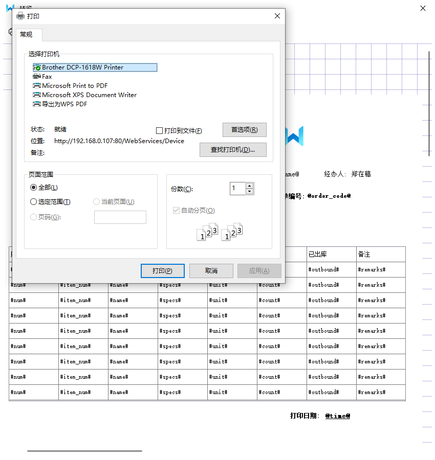

# PyQt-Socket-Printer-Widget

一款基于PyQt5制作的Windows打印机程序

<a target="_blank" href="">
		</img>
        </img>
        </img>
        </img>
        </img>
</a>

### 🐴项目描述🦄
常用的OA系统经常会使用到打印功能,一般采用web页面调用windows打印机,传输html或pdf完成打印,但在某些情况下打印出来的格式都会发生改变,歪了或缺失等等问题,一般成熟的系统都配备三种打印方式,除了web页面调用的html,pdf两种,还有一种是在本地电脑安装windows打印程序,通过接收web端传输过来的数据,再调用打印机.
以下项目使用的就是第三种方式:在本地电脑安装Gui程序调用windows打印机

### 🐴技术选型

- Python-3.11.4
- PyQt5-5.15.9
- Pyqt-fluent-widgets-5.15.9(PyQt5-UI框架)
- Pyinstaller(打包工具)

### 🐴功能概要🦄
#### 功能清单
1. **WebSocket**: 主要用于连接服务器,连接服务器后将等待服务器的传输信息
2. **纸张**: 通过配置纸张参数,后续将应用于模板设计
3. **模板设计**: 点击新增后将进入模板设计页,在此页面根据自己的需求进行设计模板
4. **数据结构**: 可查看模板配置的数据结构,后续通过socket接收到对应的数据结构,将自动渲染出对应模板
5. **文档说明**: 查看系统使用说明手册
6. **设置**: 可进行个性化设置

#### 尚未完善的功能
1. 打印出来的图像略显模糊
2. 模板设计页表格控件涉及到有单元格合并的,通过Socket传输过来不能动态将单元格合并的效果渲染出来

### WebSocket
提供以下三种连接方式:
- SocketServer: 将本地作为SocketServer服务,等待客户端的连接和消息传输
- Socket连接: 将本地作为客户端,需要指定连接的服务器地址
- Tcp连接: 将本地作为客户端,需要指定连接的服务器地址

注意:点击确定后,**下一次**打开连接将按照新的地址及端口号尝试连接服务器

当被外部连接成功后会有消息提醒

### 纸张
#### 纸张管理
1. 纸张是模板大小的参数,此后渲染到打印机上时,是以此参数为基准渲染,一般是以毫米为单位.
2. 可设置纵向宽高和横向宽高,代表着一张纸是竖着或者横着打印,一般情况下横纵的值刚好相反.

**注意:** 如果纸张数据被全部清空,在进行模板设计时,可能会出现右侧模板设计页消失,所以请尽量保证有一条默认数据

### 模板设计
#### 模板管理
在此页面中可以查看当前创建好的模板,页面中主要有三个按钮:新建,更新,删除

- **新建**: 点击新建按钮会跳转到模板设计页
- **更新**: 点击更新按钮会跳转到模板设计页,并渲染之前设计好的模板样式
- **删除**: 点击删除按钮会删除模板相关的全部数据,此操作不可回滚

#### 模板设计页
**设计页结构概述**:
- 命令栏: 位于最上侧,有<返回>,<保存>,<删除>,<背景>,<预览>,<刷新>
- 控制栏: 位于最左侧,有基本设置及每个控件的详细设计
- 设计页: 位于最右侧,白色区域为纸张,与纸张大小相关联,细线与纸张之间的距离为边距,可通过边距设置进行更改

**命令栏功能介绍:**
1. <返回>: 返回到模板管理页,不会自动保存当前设计的内容
2. <保存>: 将当前设计的内容持久化保存进磁盘,可在模板管理中看到已经保存的模板信息
3. <删除>: 删除不会删除整个模板,只会删除当前选中的小控件,关于小控件的描述可查看<控制栏>
4. <背景>: 为当前整个纸张添加一张图片作为背景
5. <预览>: 跳转到预览页查看当前设计好的内容,在预览页中可调用打印机打印模板
6. <刷新>: 考虑到纸张的宽高参数可能经常调整,添加刷新按钮,如果在纸张管理中进行更改了纸张参数,可点击<刷新>把新的纸张参数加载到当前设计页

**控制栏功能介绍:**
一. **基本设置**
- 模板名称: 为当前模板取个名称
- 纸张: 下拉框选中,纸张数据是在**纸张管理页**中进行配置
- 打印方向: 下拉框选中,分为纵向打印及横向打印,横纵打印的纸张宽高也是与**纸张管理页**中配置的一一对应
- 纸张宽度: 显示当前纸张的宽度,只允许查看不能编辑,修改需要到**纸张管理页**中进行编辑
- 纸张高度: 显示当前纸张的高度,只允许查看不能编辑,修改需要到**纸张管理页**中进行编辑
- 左边距: 调整右侧纸张中左细线到纸张外侧的距离
- 右边距: 与左边距类似
- 上边距: 与左边距类似
- 下边距: 与左边距类似
- 移除背景: 如果当前模板中添加了背景图片,可通过这个按钮进行移除
- 图片: **为右侧纸张中添加一张图片小控件,具体详情参考下方图片控件的说明**
- 单行文本: **为右侧纸张中添加一张单行文本小控件,具体详情参考下方图片控件的说明**
- 表格: **为右侧纸张中添加一张表格小控件,具体详情参考下方图片控件的说明,注意:一个模板只能添加一张表格**

二. **高级属性**

概述: 高级属性是为了单独设置每一个小控件的参数,所以需要先选中想要编辑的小控件, **注意: 每一个小控件都是可以拖动改变位置的**
- **图片控件**:
 0. 控件说明: 可拖动改变位置
 1. 打印参数: 可选第一页打印,每页打印,最后一页打印,打印参数可控制打印时控件渲染到纸张的时机
 2. 更换图片: 点击可选择放置在纸张的图片
 3. 设置宽度: 设置图片的宽度
 4. 设置高度: 设置图片的高度
 5. 设置透明度: 设置图片的透明度
 6. 布局设置: 多个控件之间可能出现遮盖,可设置让哪个控件放置在上方或下方
 7. 置于上方: 将控件放置在别的控件上方
 8. 置于下方: 将控件房子在别的控件下方

- **单行文本**:
 0. 控件说明: 可拖动改变位置
 1. 打印参数: 可选第一页打印,每页打印,最后一页打印,打印参数可控制打印时控件渲染到纸张的时机
 2. 显示边框: 下拉选择边框类型,全边框,仅下边框,仅上边框,无边框
 3. 边框类型: 下拉选择实线或虚线
 4. 边框粗细: 拖动改变边框粗细
 5. 边框宽度: 拖动修改控件的宽度
 6. 边框高度: 拖动修改控件的高度
 7. 布局设置: 多个控件之间可能出现遮盖,可设置让哪个控件放置在上方或下方
 8. 置于上方: 将控件放置在别的控件上方
 9. 置于下方: 将控件房子在别的控件下方
10. 字体设置及对齐方式

 - **表格**
 0. 控件说明: 表格是默认每页打印,所以每页打印参数,并且表格默认是不可拖动的,下方可以开启拖动后
 1. 表格宽度: 设置表格的宽度,不能超过纸张宽度
 2. 表格高度: 设置表格的高度,不能超过纸张高度
 3. 新增一列: 为表格新增一列
 4. 新增一行: 为表格新增一行
 5. 删除一列: 删除选中的列
 6. 删除一行: 删除选中的行
 7. 单元格宽度: 设置选中单元格的宽度
 8. 单元格高度: 设置选中单元格的高度
 9. 合并单元格: 选中需要合并的单元格
 10. 显示网格线:
 11. 显示边框: 
 12. 布局设置: 多个控件之间可能出现遮盖,可设置让哪个控件放置在上方或下方
 13. 置于上方: 将控件放置在别的控件上方
 14. 置于下方: 将控件房子在别的控件下方
 15. 格式化布局: 如果删除列可能出现空行的情况,可以点击格式化布局,重新均分每列宽度
 16. 移动位置: 点击开启,可以拖动改变表格位置,但不能编辑单元格内容,编辑单元格需要把移动位置给关闭
 17. 单元格的字体及对齐方式设置
 

**设计页功能概述**
 - 当前系统提供三种控件: 图片,单行文本,表格都是可以拖动改变位置的,区别在于表格的拖动需要手动通过<移动位置>开关开启
 - 三种控件的单击: 单控件在<高级属性>中就会出现当前控件的操作菜单
 - 图片控件的双击: 图片控件被双击可选择需要更改的图片文件
 - 单行文本的双击: 双击编辑单行文本的内容,**注意:必须要按下回车后才能确认下来**
 - 表格的双击: 选中某一个单元格,双击可以更改表格内容,单元格失去焦点时就会确认下来

**关于动态渲染的占位符**
1. 单行文本的占位符用: @@包裹, 如@name@, @age@,后续在数据结构中渲染的格式将会是`{"name": "", "age": ""}`

2. 表格的占位符用: ##包裹,一般以一行为标准, 如#name#, #address#,后续在数据结构中渲染的格式将会是`{"list":[{"name": "", "address": ""}]}`

**关于模板预览**

### 数据结构
将模板设计页中定义的占位符信息的结构渲染显示出来,一般是Json格式,后续通过Socket接收到相同格式的结构,可以将模板加载出来
### 文档说明
系统的使用说明手册
### 设置
对该系统进行个性化设置

## 测试
通过外部Socket连接PyQt-Socket-printer-Widget,传输模板中定义好的数据格式渲染模板,并完成打印
### 步骤
1. PyQt-Socket-printer-Widget启动SocketServer服务
2. WebSocket测试工具连接本地服务
3. 传输模板数据格式

## 鸣谢
感谢zhiyiYo提供的PyQt5UI框架PyQt-Fluent-Widgets
开源地址: https://github.com/zhiyiYo/PyQt-Fluent-Widgets

## 最后
作者微信: Tu_Yoooooo
欢迎讨论关于PyQt-Socket-Printer-Widget的一切问题
